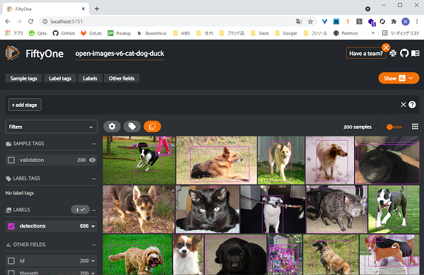

# FiftyOne の実行例

[FiftyOne] を Python スクリプト、 Jupyter notebook で実行する例

## 実行環境

Python 3.9.6

### Proxy 環境用の設定

環境変数に Proxy サーバーの URL を指定する

```sh
export HTTP_PROXY=http://<hostname>:<port>
export HTTPS_PROXY=http://<hostname>:<port>
```

### 依存パッケージのインストール

```sh
pip install --requirement requirements.txt
```

## スクリプトの実行

```sh
cd scripts
python list_zoo_datasets.py
```

## ノートブックの実行

```sh
cd notebooks
jupyter lab
```

## 編集方法

- Node.js をインストールする

- `npm install` を実行する

- `pre-commit install` を実行する

- ブランチを作成し、編集結果をコミットする

  pre-commit と commitlint によるチェックが行われる

- プルリクエストを作成する

  Super Linter によるチェックが行われる

## FiftyOne 実装

### データセット ZOO からのデータ取得

パラメータを指定して各種データセットから画像、アノテーションデータを取得できる

- データセットの種類

  _coco-2017_ や _open-images-v6_ など

- split: データセットの中の分類

  _train_ や _validation_ 、 _test_ など

  指定しなければデータセットに含まれるすべての split が取得される

  _train_ は特に大きいためリソースを消費し、ダウンロードにも時間がかかる

  少し試す場合は _validation_ を指定すると良い

- Open Image Dataset の場合

  - label_types: アノテーションデータの種類

    _detections_ や _segmentations_ など

  - classes: クラス名

    取得する画像に含まれるクラス

    _Cat_ や _Dog_ など

  - max_samples: サンプル数上限

    取得する画像の最大枚数

    split を指定していない場合、 split 毎の上限になる（train、valodation、test があれば 3 倍取得される）

  - only_matching: 一致したラベルだけを取得する（指定しなければ False）

    True にしないと、同じ画像内に含まれる別クラスの物体もラベルが付く

```python
import fiftyone.zoo as foz

dataset = foz.load_zoo_dataset(
   "open-images-v6",
   split="validation",
   label_types=["detections"],
   classes=["Cat", "Dog"],
   max_samples=100,
   only_matching=True,
)
```

データを保存する場合、名前を付けて永続化する

```python
dataset.name = "open-images-v6-cat-dog"
dataset.persistent = True
```

## ブラウザでのデータ表示

`launch_app` により、ローカルでサーバーを起動する

`port` でポート番号を指定する（指定しなければ 5151）

スクリプトから起動する場合、 `wait()` で起動したままにする

```python
import fiftyone as fo

session = fo.launch_app(dataset, port=80)
session.wait()
```



Jupyter notebook の場合、起動すると出力結果に表示される

```python
session = fo.launch_app(dataset)
```

改めて開く場合は `session.show()`


## データのエクスポート

各種パッケージやモデルの学習に使えるよう、様々な形式でエクスポートできる

- 画像識別

  ImageClassificationDirectoryTree を指定すると、画像がクラス毎にディレクトリーに仕分けれらる

  入力となるデータセットのラベルタイプは `classifications` ではなく、 `detections` である必要がある

  入力画像から当該ラベルの部分を切り取って画像識別の入力とするため

  ```python
  dataset.export(
      export_dir=f"~/classification",
      dataset_type=fo.types.ImageClassificationDirectoryTree,
  )
  ```

- VOC

  VOC 形式でエクスポートする

  ```python
  dataset.export(
      export_dir=f"~/voc",
      dataset_type=fo.types.VOCDetectionDataset,
  )
  ```

- YOLO v5

  YOLO v5 形式でエクスポートする

  クラスを指定しないと全クラスが使用されてしまう

  データを区切ることで各 split に分けて出力する

  ```python
  classes = ["Cat", "Dog", "Duck"]

  train_dataset = dataset[:700]
  val_dataset = dataset[700:800]
  test_dataset = dataset[800:]

  # YOLO V5 形式でエクスポート
  train_dataset.export(
      export_dir=f"~/train",
      dataset_type=fo.types.YOLOv5Dataset,
      split="train",
      classes=classes,
  )
  val_dataset.export(
      export_dir=f"~/val",
      dataset_type=fo.types.YOLOv5Dataset,
      split="val",
      classes=classes,
  )
  test_dataset.export(
      export_dir=f"~/test",
      dataset_type=fo.types.YOLOv5Dataset,
      split="test",
      classes=classes,
  )
  ```

[fiftyone]: https://voxel51.com/
